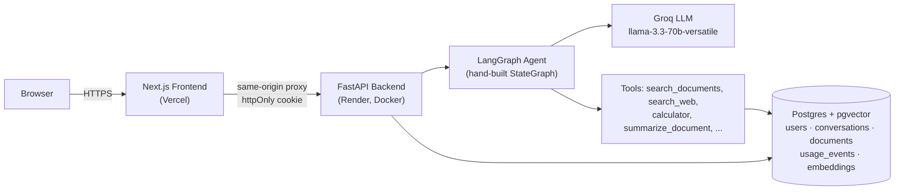

# AI Assistant Platform

[](https://github.com/GauravSinghgit/Chat-With-Documents/actions/workflows/backend.yml)
[](https://github.com/GauravSinghgit/Chat-With-Documents/actions/workflows/frontend.yml)
[](LICENSE)

A full-stack AI chat assistant: a hand-built **LangGraph** agent with tool use, **RAG** over uploaded documents via Postgres/pgvector, streaming responses, httpOnly-cookie JWT auth with real server-side route gating, and a usage-analytics admin dashboard — built with FastAPI and Next.js.

**Live demo:** [chat-with-document...vercel.app](https://chat-with-document-git-main-gaurav-singhs-projects-a7880aca.vercel.app) · Backend health: [`/api/health`](https://chat-with-documents-e6uy.onrender.com/api/health)

---

## Architecture



The frontend never talks to the backend directly from the browser — every `/api/*` call is proxied server-side through Next.js's own origin, which keeps the auth cookie same-site even though the two services live on different domains (Vercel + Render).

---

## Features

| Feature | Description |
|---|---|
| **LangGraph agent** | Hand-built `StateGraph` (not the prebuilt helper) with a tool-calling model node + `ToolNode`, looping until the model stops requesting tools |
| **6 agent tools** | `search_documents` (RAG), `search_web` (DuckDuckGo), `get_conversation_history`, `calculator`, `summarize_document`, `extract_structured_data` (structured JSON extraction) |
| **RAG** | Documents chunked and embedded into Postgres via `pgvector`, cosine-similarity search |
| **Streaming chat** | Token-by-token response via SSE |
| **httpOnly cookie auth** | JWT in an `HttpOnly`/`SameSite=Lax` cookie, verified server-side by Next.js middleware before any protected page renders — no flash-of-protected-content |
| **Admin dashboard** | Usage analytics (requests, token counts, latency, per-user breakdown, charts) for `is_admin` users only |
| **Document management** | Upload PDF/TXT/MD, auto-summary, delete, re-index, "Chat with this doc" |
| **Rate limiting** | Per-route limits via `slowapi` |
| **PII masking** | Auto-mask emails, phones, SSNs in chat input |
| **Responsive UI** | Dark mode, mobile sidebar collapses into a sheet, accessible icon buttons |

---

## Tech Stack

| Layer | Tech |
|---|---|
| LLM | [Groq](https://console.groq.com) `llama-3.3-70b-versatile` via `langchain-groq` |
| Agent | `langgraph` — hand-built `StateGraph`, not a prebuilt agent helper |
| Embeddings | `sentence-transformers/all-MiniLM-L6-v2` via `langchain-huggingface` |
| Vector store | Postgres + `pgvector` via `langchain-postgres` (`PGVector`) |
| Backend | FastAPI + SQLAlchemy 2.0 (typed `Mapped[]` columns) + Alembic + Postgres |
| Frontend | Next.js 16 (App Router) + React 19 + shadcn/ui + Tailwind |
| Auth | JWT in an httpOnly cookie, verified by Next.js middleware |
| Testing | pytest (29 tests, 85% coverage) · Vitest (19 tests) · 1 Playwright e2e spec |
| Lint / types | ruff + mypy (backend) · eslint + prettier (frontend) |
| CI/CD | GitHub Actions (lint, typecheck, test, build — see badges above) |
| Deployment | Render (Docker, Postgres+pgvector) + Vercel |

---

## Quick Start (Local)

### 1. Postgres

```bash
docker-compose up -d postgres
docker exec <container> psql -U postgres -d ai_assistant -c "CREATE EXTENSION IF NOT EXISTS vector;"
```

### 2. Backend

```bash
python -m venv venv
venv\Scripts\activate   # Windows — or `source venv/bin/activate` on macOS/Linux

pip install -r requirements.txt -r requirements-dev.txt

cp .env.example .env
# Set GROQ_API_KEY and JWT_SECRET in .env (JWT_SECRET has no default — startup
# fails loudly if unset, rather than silently using a known value)

alembic upgrade head
uvicorn app.main:app --reload --port 8000
```

- API: http://localhost:8000
- Swagger UI: http://localhost:8000/docs

### 3. Frontend

```bash
cd frontend
npm install
cp .env.local.example .env.local
# Set JWT_SECRET to match the backend's (middleware.ts verifies the cookie
# signature locally, no round-trip to the backend)
npm run dev
```

- App: http://localhost:3000

### Running tests

```bash
pytest --cov=app                    # backend
cd frontend && npm run test         # frontend unit tests
cd frontend && npm run test:e2e     # Playwright (needs both servers running)
```

---

## Docker

```bash
cp .env.example .env   # set GROQ_API_KEY and JWT_SECRET
docker-compose up --build
```

- Frontend: http://localhost:3000
- Backend: http://localhost:8000
- Postgres: `localhost:5433` (remapped to avoid clashing with a local Postgres install on 5432)

---

## Deployment

Deployed on **Render** (backend, Docker runtime, Postgres+pgvector) and **Vercel** (frontend). See [`render.yaml`](render.yaml) for the full backend service + database definition — importable directly as a Render Blueprint.

Key environment variables:

| Variable | Where | Notes |
|---|---|---|
| `GROQ_API_KEY` | Backend | Required, no default |
| `JWT_SECRET` | Backend + Frontend | Required, must match on both sides |
| `DATABASE_URL` | Backend | Postgres connection string |
| `ALLOWED_ORIGINS` | Backend | CORS allowlist — your frontend's URL |
| `NEXT_PUBLIC_API_URL` | Frontend | Backend's public URL (used by the Next.js rewrite proxy) |

---

## API Reference

| Method | Endpoint | Auth | Description |
|---|---|---|---|
| POST | `/api/auth/register` | — | Create account |
| POST | `/api/auth/login` | — | Sets httpOnly auth cookie |
| POST | `/api/auth/logout` | — | Clears auth cookie |
| GET | `/api/auth/me` | Required | Current user |
| POST | `/api/chat` | Optional | Standard or agentic chat (`use_agent: true`) |
| POST | `/api/chat/stream` | Optional | Streaming chat (SSE) |
| GET | `/api/conversations` | Required | List conversations |
| GET | `/api/conversations/{id}/messages` | Required | Get messages |
| PATCH | `/api/conversations/{id}/title` | Required | Rename |
| DELETE | `/api/conversations/{id}` | Required | Delete |
| POST | `/api/documents/ingest` | Optional | Upload PDF/TXT/MD |
| GET | `/api/documents` | Optional | List documents |
| GET | `/api/documents/{id}` | Optional | Get document |
| DELETE | `/api/documents/{id}` | Required | Delete + remove vectors |
| POST | `/api/documents/{id}/reindex` | Required | Re-embed document |
| GET | `/api/admin/stats` | Admin only | Usage analytics |
| GET | `/api/health` | — | Health + service status |

---

## Project Structure

```
ai-assistant-platform/
├── app/
│   ├── api/            # routes: auth, chat, documents, conversations, admin, health
│   ├── services/        # llm, embeddings, vectorstore, rag, agent (LangGraph), tools, memory
│   ├── utils/           # logger, rate_limit, security, prompts, usage
│   ├── config.py        # Pydantic settings from env/.env
│   ├── models.py        # SQLAlchemy ORM, typed Mapped[] columns
│   ├── schemas.py        # Pydantic request/response models
│   └── main.py           # FastAPI app entry point
├── alembic/               # DB migrations
├── tests/                  # pytest suite (29 tests, 85% coverage)
├── frontend/
│   ├── app/
│   │   ├── (auth)/          # /login, /register
│   │   ├── chat/             # /chat + /chat/[id]
│   │   ├── documents/         # /documents
│   │   └── admin/               # /admin — usage dashboard
│   ├── components/chat/         # AppShell, ChatSidebar, ChatInterface, ChatInput, MessageBubble
│   ├── components/ui/            # shadcn/ui components
│   ├── e2e/                       # Playwright spec
│   └── lib/                        # api clients, hooks
├── .github/workflows/               # CI: backend.yml, frontend.yml
├── docker-compose.yml
├── Dockerfile
├── render.yaml
├── pyproject.toml                     # ruff + mypy config
└── requirements.txt
```

---

## Notable Engineering Decisions

| Decision | Why |
|---|---|
| Hand-built LangGraph `StateGraph` instead of `create_react_agent` | Demonstrates understanding of the framework rather than just calling a prebuilt helper |
| httpOnly cookie auth + Next.js middleware verification | Replaced a Bearer-token-in-`localStorage` scheme (XSS-exposed, no real server-side route gating) |
| Postgres + pgvector for both relational data and embeddings | One database instead of SQLite + a separate FAISS index on local disk — simpler ops, no local-file state to lose on redeploy |
| RAG fallback in the agent | Groq's function-calling occasionally emits malformed syntax the API rejects (`tool_use_failed`); the agent catches this and falls back to a direct RAG-augmented answer instead of a raw 500 |
| CPU-only `torch` pin in `requirements.txt` | `sentence-transformers` pulls in `torch`; unpinned, Linux resolves the CUDA build and drags in several GB of unused NVIDIA packages |
| `bcrypt==4.0.1` pin | `passlib==1.7.4`'s internal self-test reads a `bcrypt` attribute removed in `bcrypt>=4.1` — an unpinned install crashes on the very first `hash_password()` call |
| `.dockerignore` at both repo root and `frontend/` | Without them, every Docker build sent the entire working tree (including the other app's `node_modules`) as build context |

---

## License

[MIT](LICENSE)
